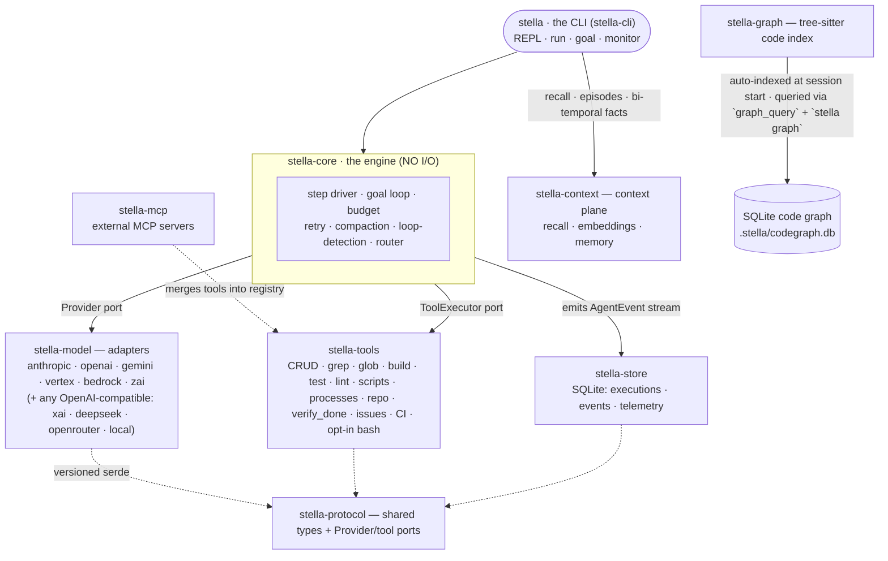

<p align="center">
  <picture>
    <source media="(prefers-color-scheme: dark)" srcset="docs/brand/lockups/lockup-horizontal-dark.svg">
    <source media="(prefers-color-scheme: light)" srcset="docs/brand/lockups/lockup-horizontal-light.svg">
    
  </picture>
</p>

<p align="center"><strong>Open Source. No Phone Home. BYOK. RUST. and Damn Good.</strong></p>
<p align="center">
  <a href="https://github.com/macanderson/stella/actions/workflows/ci.yml"></a>
  <a href="https://github.com/macanderson/stella/actions/workflows/release.yml"></a>
  <a href="#license"></a>
  
  
</p>

<p align="center">
  <a href="https://stella.oxagen.sh"><b>Website</b></a> ·
  <a href="https://stella.oxagen.sh/docs"><b>Docs</b></a> ·
  <a href="https://stella.oxagen.sh/docs/getting-started/installation"><b>Quickstart</b></a>
</p>

Stella is an open-source, bring-your-own-key (BYOK) coding agent that runs in
your terminal. It supports nine hosted model providers plus any local
OpenAI-compatible server, keeps all telemetry in a local SQLite database (no
phone-home), and enforces a hard per-run budget. It is built in Rust as a
workspace of focused crates.

## Features

- **BYOK, auto-detected** — Set one provider's API key and Stella detects it.
  Pin a specific model per run or shell with `--model`.
- **Deterministic definition of done** — `verify_done` replays your new test
  files against the previous code in a shadow worktree at `git HEAD`; the test
  must fail there and pass on your change. A green suite alone is not accepted.
- **Single-threaded engine** — One deterministic step loop: plan, fan tools out
  in parallel, observe, compact if noisy, repeat. No coordinator or multi-agent
  swarm.
- **Prompt-cache-native memory** — Lessons saved with `save_memory` load once at
  session start into a byte-stable system prompt (~0.1× input cost).
- **Code graph** — A tree-sitter symbol/import index (Rust, TS/JS, Python, SQL)
  queried by the agent and the `stella graph` command instead of grepping.
- **Local-only telemetry** — Executions, events, token/cost telemetry, and the
  files-touched ledger in `.stella/store.db`. The only network traffic Stella
  produces is to the model provider you chose.
- **Budget enforcement** — A `--budget` flag aborts cleanly between steps, never
  mid-tool.
- **Goal & fleet modes** — `goal` works in judged rounds; `fleet` fans a task DAG
  out to parallel workers, each in its own git worktree.
- **Lifecycle hooks** — Shell-command hooks (`SessionStart`, `PreToolUse`,
  `PostToolUse`) configurable in `settings.json`.

## Prerequisites

- **macOS or Linux**, `x86_64` or `arm64`.
- For prebuilt / Homebrew install: `curl`.
- For building from source: **Rust 1.90+** (via [rustup](https://rustup.rs)) and `git`.
- An API key for any supported provider, *or* a local OpenAI-compatible model
  server (Ollama, vLLM, LM Studio, llama.cpp).
- Optional: [`ripgrep`](https://github.com/BurntSushi/ripgrep) and
  [`fd`](https://github.com/sharkdp/fd) on `PATH` (used by the `grep`/`glob`
  tools), and `gh` for the CI/issue tools.

## Install

**Prebuilt binary:**

```bash
curl -fsSL https://raw.githubusercontent.com/macanderson/stella/main/install.sh | sh
stella --version
```

The installer downloads the latest release tarball, verifies its SHA-256, and
falls back to `cargo install` when no prebuilt binary matches your platform.

**Homebrew:**

```bash
brew install macanderson/tap/stella
```

To build from source via Homebrew:
`brew install --build-from-source ./packaging/homebrew/stella.rb`.

**From cargo** (requires Rust 1.90+ and git):

```bash
cargo install --locked --git https://github.com/macanderson/stella stella-cli
stella --version
```

**From source:**

```bash
git clone https://github.com/macanderson/stella.git
cd stella
cargo build --release
./target/release/stella --version
```

## Set your API key

Stella is BYOK and auto-detects the provider from whichever keys you have set.

| Provider | Env var | Default model |
|---|---|---|
| **Z.ai** (GLM) | `ZAI_API_KEY` | `glm-5.2` |
| **Anthropic** (Claude) | `ANTHROPIC_API_KEY` | `claude-fable-5` |
| **OpenAI** (GPT) | `OPENAI_API_KEY` | `gpt-5.5` |
| **xAI** (Grok) | `XAI_API_KEY` | `grok-4` |
| **DeepSeek** | `DEEPSEEK_API_KEY` | `deepseek-chat` |
| **Google Gemini** | `GEMINI_API_KEY` (alias `GOOGLE_API_KEY`) | `gemini-3-pro` |
| **OpenRouter** | `OPENROUTER_API_KEY` | `auto` |
| **Google Vertex AI** | `VERTEX_ACCESS_TOKEN` + `VERTEX_PROJECT_ID` | `gemini-3-pro` |
| **Amazon Bedrock** | `AWS_ACCESS_KEY_ID` + `AWS_SECRET_ACCESS_KEY` | Claude via Converse |
| **Local** | *none* — pass `--base-url` | whatever your server hosts |

```bash
export ANTHROPIC_API_KEY=your_key_here     # or OPENAI_API_KEY, GEMINI_API_KEY, …
```

Pin a provider/model per run or shell:

```bash
stella --model anthropic/claude-fable-5 run "refactor the database layer"
export STELLA_MODEL=openai/gpt-5.5
```

**Local / any OpenAI-compatible gateway** — no key required:

```bash
stella --model local/llama3.3 --base-url http://localhost:11434/v1 chat
```

**Z.ai GLM Coding Plan:** set `ZAI_GLM_CODING_PLAN=1` alongside `ZAI_API_KEY` to
route through the dedicated coding endpoint.

**Credential chain** (first hit wins): `--api-key` flag → provider env var →
`settings.json` `api_key` → `~/.config/stella/credentials.toml` → interactive prompt.

**Project `.env` files** — so keys can follow the project you're in, Stella
reads `.env`, `.env.local`, and `.env.<mode>.local` (e.g. `.env.production.local`)
from the working directory (or the nearest ancestor within the same git repo)
into the environment at startup, most-specific file first. Template files
(`.env.example`, `.env.sample`, `.env.dist`) and non-`.local` mode files
(`.env.production`) are never read. **Your live shell always wins** — a value
already exported (or `OPENROUTER_API_KEY=… stella …`) is never overwritten by a
file, so unset a stale export if you mean to switch. Disable the whole mechanism
with `STELLA_NO_ENV_FILE=1`; see what loaded with `STELLA_ENV_DEBUG=1`.

```bash
stella models    # list providers, models, and key status
stella config    # show the fully resolved configuration
```

### Custom providers via `settings.json`

Point Stella at any OpenAI-compatible (or Anthropic/Gemini-dialect) endpoint
without a code change, and override built-in defaults, from a `settings.json`:

| Scope | Path | Wins over |
|---|---|---|
| Project | `<workspace>/.stella/settings.json` | org-managed, user |
| Org-managed | `/Library/Application Support/stella/settings.json` (macOS) · `/etc/stella/settings.json` (Linux) · `$STELLA_MANAGED_SETTINGS` | user |
| User | `~/.config/stella/settings.json` | — |

```jsonc
{
  "providers": {
    // A brand-new provider: base_url is required, dialect defaults to
    // "openai-compatible" ("anthropic" and "gemini" also available).
    "together": {
      "name": "Together AI",
      "base_url": "https://api.together.xyz/v1",
      "api_key_env": "TOGETHER_API_KEY",
      "default_model": "meta-llama/Llama-3.3-70B-Instruct-Turbo"
    },
    // Overriding a built-in's defaults (e.g. the Z.ai coding plan):
    "zai": {
      "base_url": "https://api.z.ai/api/coding/paas/v4"
    }
  }
}
```

Then: `stella --model together/meta-llama/Llama-3.3-70B-Instruct-Turbo run "…"`.
Prefer `api_key_env` over a literal `api_key` — settings files get committed.

> **Untrusted repos can't redirect your key.** A cloned repo's project-scope
> `.stella/settings.json` is untrusted: its credential-routing fields
> (`base_url`, `api_key`, `api_key_env`, and `mcp.registry_url`) are **ignored**
> unless you opt in with `STELLA_TRUST_PROJECT=1`, so a hostile repo can't
> silently point your real API key at its own server. Cosmetic fields
> (`name`, `default_model`, `dialect`) still apply; the user and org-managed
> scopes are always trusted. Project hooks are gated the same way, via
> `STELLA_PROJECT_HOOKS`.

### Agent engine config (`agent_engine_config`)

The engine runs four configurable agents — **default** (the interactive /
step-loop agent) and the pipeline's **worker**, **judge**, and **triage**.
The `agent_engine_config` object in the same `settings.json` scope chain
configures each one's model, gateway, system prompt, reasoning, and sampling
parameters — and in the Command Deck, `/engine` opens an editor popup for
all of it (`s` saves to user scope, `S` to project scope; `/model-worker`,
`/model-judge`, `/model-triage`, `/model-default` jump straight to a model
picker driven by `allowed_models`).

```jsonc
{
  "agent_engine_config": {
    // Flat per-role models ("provider/slug", or a bare catalog slug).
    "default_model": "anthropic/claude-fable-5",
    "pipeline_worker_model": "zai/glm-5.2",
    "pipeline_judge_model": "openrouter/openai/gpt-5.5",
    "pipeline_triage_model": "deepseek/deepseek-chat",

    // The model vocabulary the TUI pickers offer and auto_mode selects from.
    "allowed_models": ["anthropic/claude-fable-5", "zai/glm-5.2",
                        "openrouter/openai/gpt-5.5"],

    // "on" = pick the judge automatically from allowed_models: prefer a
    // different model family than the worker's, then the highest catalog
    // price tier. You never worry about it.
    "auto_mode": "off",
    // "on" = per-agent effort is chosen for you (judge high, worker
    // medium, triage low), overriding any per-agent "effort".
    "effort_auto": "off",
    // "on" = thinking mode chosen for you (on everywhere except triage).
    "reasoning_auto": "off",

    // Per-agent deep config. Every field is optional — set it and it goes
    // on the wire; leave it out and the provider default applies.
    "agents": {
      "judge": {
        "provider": "openrouter",         // gateway: the slug goes to THIS
        "model": "openai/gpt-5.5",        // provider verbatim (BYOK per agent)
        "prompt": "You are a strict, evidence-first code judge.",
        "effort": "high",                  // low | medium | high | xhigh | max
        "reasoning": "on",                 // thinking mode on/off
        "params": {
          "temperature": 0.2, "top_p": 0.9, "top_k": 40,
          "frequency_penalty": 0.0, "presence_penalty": 0.0,
          "repetition_penalty": 1.0, "max_tokens": 4096, "seed": 7,
          "verbosity": "low",              // OpenAI/Anthropic-family models
          "service_tier": "priority"       // providers with tiered service
        }
      }
    }
  }
}
```

Precedence per agent: `--model` flag > `agents.<agent>.model` >
`pipeline_<agent>_model` > `default_model` > auto-detect. An agent's
`provider` field routes its slug through that gateway verbatim, so the
worker can run on your Anthropic key while the judge routes
`openai/gpt-5.5` through your OpenRouter key and triage hits Z.ai. Each
adapter forwards only the parameters its wire supports (`verbosity` and
`service_tier` are dropped where meaningless); reasoning maps to GLM's
`thinking`, OpenRouter's `reasoning`, Anthropic extended thinking (with an
effort-tiered budget), OpenAI `reasoning.effort`, and Gemini
`thinkingLevel`. Custom prompts replace the built-in base instructions;
workspace memories and rules still append. A judge/triage model whose
provider has no resolvable key degrades softly — the role rides the worker
and a notice says so.

## Usage

### Interactive chat (default)

```bash
stella            # or: stella chat
```

On a TTY this opens the **Command Deck** — a tabbed TUI (Session · Agents ·
Traces · Graph · Files · Skills · MCP) with PR-style diffs and an editable prompt
queue. `--plain` (or `STELLA_PLAIN=1`, or piped stdio) falls back to the line REPL.

**In-chat commands:**

| Command | Does |
|---|---|
| `/goal <text>` | Work in judged rounds until the goal is met |
| `/files` | Show the Files-Touched panel — `[C·R·U·D] path` per file |
| `/models` `/config` | List providers/models · show resolved configuration |
| `/rename <name>` `/color <name>` | Rename the tab · switch accent color |
| `/pipeline` | Toggle witness-verified staged turns (Command Deck; see `stella-docs/content/docs/inference-pipeline.mdx`) |
| `/clear` `/help` | Clear history · show help |
| `/exit` or `Ctrl-D` | Exit |

### One-shot run

```bash
stella run "fix the failing test in src/auth.rs"
stella run "add a health check endpoint to the API"
```

### Goal mode

```bash
stella goal "the login flow has a passing e2e test and CI is green"
stella monitor main          # drive a branch/PR's CI to green as a judged goal
```

### Fleet mode

```bash
stella fleet "fix the flaky auth test" "tighten the CI cache key"   # two isolated tasks
stella fleet --plan .stella/fleet.toml --max-concurrency 2 --budget 5.0
```

One git worktree + `fleet/<task>` branch per task, wave-scheduled by dependency,
recorded in `.stella/fleet.db`. A plan file is the serde form of the fleet DAG:
`[[tasks]]` entries with `id`, `title`, `prompt`, optional `depends_on`, and
`isolation`.

### Code graph queries

```bash
stella graph definitions run_turn     # where is this symbol defined?
stella graph importers src/auth.rs    # which files import it?
```

Built by `stella init`, answered offline, no API key needed.

### Project setup & introspection

```bash
stella init      # infer this workspace's domain taxonomy (.stella/domains.toml)
stella tools     # list every tool available to the agent this session
stella stats     # cost, tokens, and $/resolved task per provider/model
                 # (--format table|json|csv, --provider <id>)
```

### Global flags

`--model provider/id` · `--api-key` · `--base-url` · `--budget <usd>` ·
`--output-format text|json|stream-json` (also as `STELLA_MODEL`,
`STELLA_BASE_URL`, `STELLA_BUDGET`, `STELLA_OUTPUT_FORMAT`). The `json` /
`stream-json` formats are for headless one-shot `stella run`; interactive
`chat` / `goal` / `monitor` modes render human-readable output. `stella run`
uses the staged pipeline by default; `--no-pipeline` falls back to the raw
step-loop. In pipeline mode, `--test-command <cmd>` arms deterministic
verification with your own test; without it an independent witness author
writes a failing test whose fail→pass flip proves the work (`stella-docs/content/docs/inference-pipeline.mdx`).

## Built-in tools

| Tool | Description |
|---|---|
| `read_file` · `write_file` · `edit_file` · `delete_file` | File CRUD with surgical exact-substring edits |
| `bash` | Run a shell command (timeout kill; `trace: true` echoes each line) — **off by default**, registered only with `"tools": {"bash": "on"}` in settings (any scope) |
| `grep` · `glob` | Regex content search (ripgrep) · glob file discovery (fd) |
| `graph_query` | Query the indexed code graph: symbol definitions/references, file imports/importers/neighborhood — auto-built at session start, refreshed live |
| `build_project` · `run_tests` | Build/test with the workspace's toolchain (cargo/npm/go/make) |
| `run_lint` · `format_code` | The project's own linter/formatter (cargo clippy/fmt, or package.json `lint`/`format` scripts), spawned argv-style — no shell |
| `run_script` | Run a verb the project itself declares (Makefile target, package.json script, cargo alias); unknown names list the discovered vocabulary |
| `start_process` · `read_output` · `send_stdin` · `stop_process` | Long-running processes (dev servers, REPLs, watchers) from an argv vector — capped output ring, SIGTERM-then-kill stop, reaped at session end |
| `repo_status` · `repo_commit` · `repo_push` · `repo_pull` · `repo_rollback` | Vendor-neutral repository tools: structured status, pathspec-explicit commits, pushes that structurally refuse the default branch (never forced), fast-forward-only pulls, restore-named-paths rollback |
| `verify_done` | Replay new test files against `git HEAD` to prove the change works |
| `explorations` · `save_exploration` | Shared codebase maps — explore once, reuse everywhere |
| `save_memory` | Persist a lesson into every future session's system prompt |
| `ci_status` | CI runs + failure logs via `gh` |
| `screenshot` | Capture the screen as verification evidence |
| `generate_image` | Text-to-image via your provider key, saved under `.stella/artifacts/` — registered only when a media-capable key is set |
| `create_issue` · `update_issue` · `close_issue` · `search_issues` · `get_issue` · `list_labels` · `list_members` · `start_work_on_issue` | Issue tracking (GitHub/Linear) — registered only when a tracker is connected (`stella connect github\|linear`, `LINEAR_API_KEY`, or `gh` auth) |

All file tools are workspace-root-pinned, and every read/write/edit/delete is
recorded in the Files-Touched ledger (shown per turn as `[C·R·U·D] path`, also
via `/files`).

**Bash is opt-in.** The default tool surface has no shell: the model works
through enumerable-argv tools (build/test/lint/format, `run_script`'s
project-declared verbs, the process group, the `repo_*` tools). Enable `bash`
per user, org, or project by adding `"tools": {"bash": "on"}` to the
corresponding `settings.json` scope (normal per-field merge — project wins).

**Opt-in bash sandbox:** `STELLA_BASH_SANDBOX=workspace-write` confines `bash`
file writes to the workspace root plus the standard tmp dirs (network still
allowed); `restricted` additionally denies all network. Backends:
`sandbox-exec` (Seatbelt) on macOS, `bwrap` (bubblewrap) on Linux. This bounds
the blast radius of prompt injection — instructions hidden in a file the agent
reads can steer the model into running arbitrary commands. The tradeoff is
capability: the sandbox also blocks legitimate work (`cargo` writing
`~/.cargo`, `npm`/`pip` caches under `$HOME`, `git push` under `restricted`),
which is why the default is `off`. Fail-closed: an unknown value, a missing
`bwrap`, or an unsupported platform fails the tool call rather than silently
running unsandboxed.

**Conditional tools:** issue tools need `LINEAR_API_KEY` or a `gh auth login`;
`graph_query` needs the code-graph index (auto-built at session start);
`generate_image` needs
`ZAI_API_KEY` or `OPENAI_API_KEY`. Without their prerequisites, these tools are
not registered.

## Memory and context

Lessons saved with `save_memory` (or written as markdown in
`.stella/memories/`) load once at session start into a byte-stable system
prompt, so every model call considers them at prompt-cache prices. New memories
take effect the next session — hot-injection would invalidate the cache.

Every working turn is also recorded as an **episode** (summary, files touched,
outcome, time window) in `.stella/context.db`, and `stella init` writes the
domain taxonomy as bi-temporal facts. Recall fans out through the OCP host to
the memory store and the code graph, fused by score under one budget.

## Telemetry

Executions are recorded, best-effort, in `.stella/store.db`: the full event
stream, per-model-call telemetry (tokens, cache hits, cost), and the
Files-Touched ledger. The store is never a dependency of a turn — a session
runs even if the file can't be opened. Query it with any SQLite client.

## Lifecycle hooks

Declare shell-command hooks in any `settings.json` scope; they fire on agent
lifecycle events, receiving the event payload as JSON on stdin:

```jsonc
{
  "hooks": {
    "SessionStart": [
      { "hooks": [{ "command": "echo \"on-call: $(cat .oncall 2>/dev/null)\"" }] }
    ],
    "PreToolUse": [
      { "matcher": "bash", "hooks": [{ "command": "./scripts/guard-bash.sh", "timeoutMs": 5000 }] }
    ]
  }
}
```

- **`SessionStart`** — stdout is appended to the system prompt as session
  context (once per session).
- **`PreToolUse`** — a non-zero exit blocks the tool; the model sees the hook's
  message instead. `matcher` is a glob over the tool name.
- **`PostToolUse`** — observation only, never blocks.

Scopes concatenate (any scope can add a gate; none can remove another's). Hooks
from a repo's own `.stella/settings.json` load only with
`STELLA_PROJECT_HOOKS=1`, so cloning an untrusted repo never auto-executes its
commands.

## Architecture

`stella-core` has no I/O of its own: it drives model calls through the
`Provider` port and tools through the `ToolExecutor` port, emitting an
`AgentEvent` stream over a channel. All decision logic — compaction, eviction,
loop detection, budget — is plain synchronous functions over owned data, so a
new vendor or tool is an adapter, never a rewrite.



## Design principles

- **Ports, not concretions** — `stella-core` never imports a provider SDK, a
  filesystem call, or a terminal library; it drives through traits.
- **No I/O in the engine** — all decision logic is synchronous functions over
  owned data, so the whole engine is property-testable.
- **No phone-home** — zero network calls other than your chosen model provider.
- **BYOK** — any provider key, any combination, no account.
- **Serde-first** — every cross-boundary type round-trips through `serde_json`
  byte-for-byte.
- **Fail loud, recover gracefully** — typed, named errors; never a bare string,
  never a `panic`.
- **Budget enforced at safe boundaries only** — never mid-tool; an abort
  recommendation is acted on between steps.

## Workspace layout

Fourteen `stella-*` crates make up the workspace. The Open Context Protocol —
the retrieval abstraction Stella's recall routes through — now lives in its own
repository and is pulled in as a pinned git dependency, not as workspace members.

| Crate | Role |
|---|---|
| `stella-cli` | CLI binary — clap surface + agent loop wiring |
| `stella-core` | The step-driver engine (no I/O): parallel tools, goal loop, budget, retry, compaction, loop detection, router |
| `stella-tools` | The built-in tools (CRUD, `grep`/`glob`, build/test/lint/format, `run_script`, the process group, the `repo_*` tools, `verify_done`, issues, CI — plus the opt-in `bash`) |
| `stella-model` | The `Provider` port's adapters: anthropic, openai, gemini, vertex, bedrock, zai (SSE, tool-call dialects, SigV4, pricing) |
| `stella-store` | SQLite persistence — executions, events, telemetry, files-touched |
| `stella-mcp` | MCP client (stdio + HTTP, protocol `2025-06-18`) merging external tools into the registry |
| `stella-protocol` | Zero-logic, zero-I/O stability contract: shared serde types + the `Provider`/tool ports |
| `stella-context` | The context plane: reflection-memory recall + embedding index, episodes, bi-temporal facts |
| `stella-graph` | Tree-sitter symbol + import-edge indexer (Rust/TS/JS/Python/SQL) |
| `stella-pipeline` | The orchestration plane above the engine — the default `stella run` path: triage → plan → scope review → witness → execute → verify → judge (`stella-docs/content/docs/inference-pipeline.mdx`) |
| `stella-fleet` | The multi-agent fleet behind `stella fleet`: DAG planner + wave scheduling, git-worktree isolation per task |
| `stella-media` | Multimodal generation behind one `MediaProvider` port — `generate_svg` always on; `generate_image` and `generate_video`/`poll_video` registered when a media-capable key is set (video behind a headless cost gate) |
| `stella-tui` | The Command Deck — a pure event-fold core + thin crossterm shell |
| `stella-observatory` | The Observatory — `stella observe`'s loopback-only telemetry dashboard over the local SQLite stores |
| Open Context Protocol | Its own project now: [macanderson/context-graph-protocol](https://github.com/macanderson/context-graph-protocol) — wire types, host runtime, and the public conformance suite. Stella is its reference host and depends on it via git. |

The repo is a **monorepo**: alongside the Rust workspace, the documentation
site ([stella.oxagen.sh](https://stella.oxagen.sh)) lives at `stella-docs/`
(Next.js + Fumadocs), orchestrated by a pnpm workspace at the root. Rust
crates are deliberately *not* pnpm packages — cargo remains their build
system; the root `package.json` only bridges convenience scripts.

## Development

```bash
cargo build --workspace
cargo test --workspace
cargo clippy --workspace --all-targets -- -D warnings
cargo run -p stella-cli -- models
```

### The docs site

```bash
pnpm install     # once (Node ≥ 20, pnpm 11)
pnpm dev         # serve the docs at http://localhost:3400
pnpm build       # production build (what docs.yml CI runs)
```

Docs content is MDX under `stella-docs/content/docs/`. Docs-only changes run
the fast `docs` workflow in CI instead of the Rust gate.

To try your working copy against real projects before a release, install it as
`stella-dev` — it lives side by side with the released `stella`:

```bash
scripts/dev.sh install        # build (release) + link ~/.local/bin/stella-dev
cd ~/any/other/repo
stella-dev                    # the Command Deck, running your checkout
scripts/dev.sh status         # show what both binaries resolve to
scripts/dev.sh uninstall      # remove the link
```

## Contributing

Contributions are welcome — MIT OR Apache-2.0, DCO not CLA. See
[`CONTRIBUTING.md`](CONTRIBUTING.md) for dev setup, a tour of the crates, the
witness-test contract, and style rules. CI runs `fmt`, `clippy -D warnings`,
tests, and a release build on every PR.

| You have… | Do this |
|---|---|
| A bug | [File it with a repro](https://github.com/macanderson/stella/issues/new?template=bug_report.yml) |
| An idea | [Open a feature request](https://github.com/macanderson/stella/issues/new?template=feature_request.yml) or start a [discussion](https://github.com/macanderson/stella/discussions) |
| An evening | Grab a [`good first issue`](https://github.com/macanderson/stella/issues?q=is%3Aissue+is%3Aopen+label%3A%22good+first+issue%22) |

## License

Dual-licensed under **MIT OR Apache-2.0** — see [`LICENSE-MIT`](LICENSE-MIT) and
[`LICENSE-APACHE`](LICENSE-APACHE).
