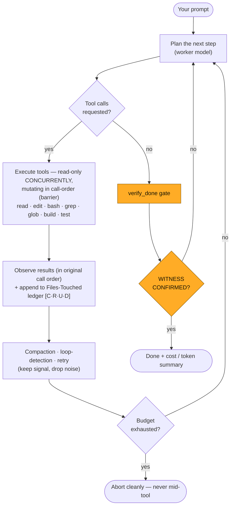
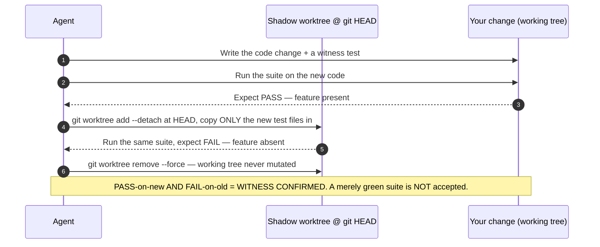
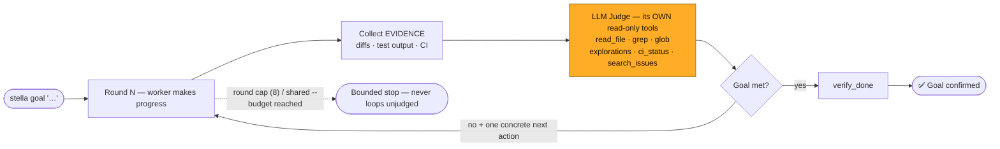
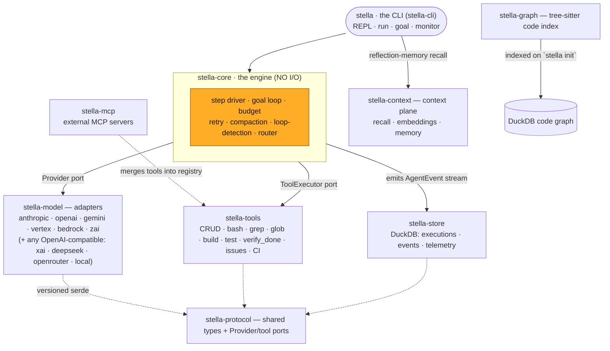

<p align="center">
  <picture>
    <source media="(prefers-color-scheme: dark)" srcset="assets/stella-logo-dark-transparent.svg">
    <source media="(prefers-color-scheme: light)" srcset="assets/stella-logo-light.svg">
    
  </picture>
</p>

```text
        ·  .  ✦   ·        ·   ✦        .   ·      ✦   .        ·
   ███████╗████████╗███████╗██╗     ██╗      █████╗    ·   .   ✦
   ██╔════╝╚══██╔══╝██╔════╝██║     ██║     ██╔══██╗       ·
   ███████╗   ██║   █████╗  ██║     ██║     ███████║   ✦        ·
   ╚════██║   ██║   ██╔══╝  ██║     ██║     ██╔══██║      ·   .
   ███████║   ██║   ███████╗███████╗███████╗██║  ██║  ·      ✦
   ╚══════╝   ╚═╝   ╚══════╝╚══════╝╚══════╝╚═╝  ╚═╝    .   ·
   a deterministic coding agent · verified done, not claimed done
```

<p align="center"><strong>A fast, BYOK, model-agnostic terminal coding agent, built in Rust — that refuses to call a task done until a test proves it.</strong></p>

<p align="center"><em>For everyone who is sick of token waste and average agent runners.</em></p>

<p align="center">
  <a href="https://github.com/oxageninc/stella/actions/workflows/ci.yml"></a>
  <a href="https://github.com/oxageninc/stella/actions/workflows/release.yml"></a>
  <a href="#license"></a>
  
  
  
  
  <a href="#the-arena"></a>
  <a href="https://github.com/sponsors/macanderson"></a>
</p>

<p align="center">
  <a href="https://docs.oxagen.sh/stella"><b>Website</b></a> ·
  <a href="https://docs.oxagen.sh/docs/stella"><b>Docs</b></a> ·
  <a href="https://docs.oxagen.sh/docs/stella/quickstart"><b>Quickstart</b></a> ·
  <a href="#why-stella-stands-apart"><b>Why it's different</b></a> ·
  <a href="#the-arena"><b>⚔ The Arena</b></a> ·
  <a href="https://oxagen.sh/#field-manual"><b>The Field Manual</b></a>
</p>

<div align="center">

`·  ·  ✦  ·  ·  ───────────────────────────────────────────────  ·  ·  ✦  ·  ·`

</div>

> **The field manual is the theory. Stella is the running code.**
>
> Stella is the open-source reference implementation of [*Engineering Deterministic
> AI Coding Agents*](https://oxagen.sh/#field-manual) — Oxagen's 14-part field manual on why
> "the next leap in AI coding isn't a bigger model, it's a better system around the
> model." Every design decision below traces back to a chapter of that manual and to
> the primary research it cites. From the makers of [Oxagen](https://docs.oxagen.sh).

## Why Stella stands apart

Most coding agents search, guess, and stop at *"the test suite is green."* Stella
is engineered around a harder contract — and every row below is a working feature
of the shipping `stella` CLI today, not a roadmap item:

| | What most agents do | What Stella does | Manual |
|---|---|---|---|
| 🎯 **Done** | Stop when the suite is green | Stop only when a **witness test fails on the old code and passes on the new** (`WITNESS CONFIRMED`) | Part 10 |
| 🔑 **Models** | Locked to one vendor / one account | **BYOK, 9 providers + any local server** — auto-detected, pinnable per run | Part 14 |
| 🧵 **Orchestration** | Sprawling multi-agent swarms that lose the plot | One **deterministic single-thread engine** — no coordinator tax | Part 9 |
| 💾 **Memory** | Re-read the world every session | **Prompt-cache-native** lessons in a byte-stable prompt (~0.1× input price) | Parts 6 & 11 |
| 📡 **Telemetry** | Phone home to a SaaS backend | **Zero phone-home.** Every event in a local `DuckDB` file — your data, your disk | Part 13 |
| 💰 **Cost** | Runs until you notice the bill | A **hard `--budget`** that aborts cleanly, never mid-tool | Part 1 |

<div align="center">

`·  ·  ✦  ·  ·  ───────────────────────────────────────────────  ·  ·  ✦  ·  ·`

</div>

<a id="the-arena"></a>

## ⚔ The Arena

```text
       ·  ✦   ·        ·   ✦        .   ·      ✦   .        ·
    █████╗ ██████╗ ███████╗███╗   ██╗ █████╗      ·   .   ✦
   ██╔══██╗██╔══██╗██╔════╝████╗  ██║██╔══██╗         ·
   ███████║██████╔╝█████╗  ██╔██╗ ██║███████║     ✦        ·
   ██╔══██║██╔══██╗██╔══╝  ██║╚██╗██║██╔══██║        ·   .
   ██║  ██║██║  ██║███████╗██║ ╚████║██║  ██║    ·      ✦
   ╚═╝  ╚═╝╚═╝  ╚═╝╚══════╝╚═╝  ╚═══╝╚═╝  ╚═╝      .   ·
   same model · same budget · official scoring · receipts or it didn't happen
```

**This repo is a standing challenge.** Stella exists because we are sick of token
waste and average agent runners — agents that re-read the world every session,
spiral through retry loops on your dime, and declare victory on a green suite
nobody witnessed. We didn't build Stella to coexist with Claude Code, Codex CLI,
Gemini CLI, and Aider. We built it to **beat them, in public, with receipts** —
and the harness to prove it ships in this repo.

```text
   STELLA ────────────────────⚔────────────────────  THE BIG BOYS
   your keys · 9 providers + local  │  one vendor, their account
   telemetry on your disk (DuckDB)  │  telemetry in their cloud
   WITNESS CONFIRMED                │  "looks done to me"
   hard --budget, aborts cleanly    │  runs until you notice the bill
   $ per resolved task              │  $ per vibe
```

### The rules — receipts or it didn't happen

1. **Same model on both sides.** BYOK makes this a fair fight: run the exact same
   `claude-fable-5` under Stella and under Claude Code, and the *harness* — not
   the model — is the variable being measured.
2. **Same per-task budget.** Every instance is capped by `--budget`. Burning 4×
   the tokens to tie is a loss.
3. **Official scoring only.** SWE-bench Verified's Docker evaluator, unmodified.
   No self-graded homework.
4. **Publish everything.** `predictions.jsonl`, `summary.json`, per-instance
   logs, and the token/cost numbers straight out of your local DuckDB telemetry.
   If it can't be reproduced, it didn't happen.

### Pick your division

| Division | The game | Wins on |
|---|---|---|
| 🥇 **Heavyweight** | Frontier model, $2/task cap | Highest resolve rate |
| 🪶 **Featherweight** | Any model, any cap | Lowest **$ per resolved task** |
| 🔌 **Off-grid** | Local models only (`--base-url`, zero API keys) | Resolve rate at $0 marginal cost |
| ⚔️ **Cross-harness** | Same model, Stella vs. any other agent CLI | Biggest head-to-head gap |

### Enter

```bash
# 1 · build the contender
cargo build --release -p stella-cli

# 2 · validate the wiring — spends nothing
python3 bench/run_swebench.py --instances bench/instances.sample.jsonl --dry-run

# 3 · fight — your keys, your budget
export ANTHROPIC_API_KEY=...   # or any provider you prefer
python3 bench/run_swebench.py --limit 25 --model anthropic/claude-fable-5 --budget 2.0

# 4 · score with the official evaluator (Docker required)
pip install swebench
python -m swebench.harness.run_evaluation \
  --predictions_path bench/results/<run-id>/predictions.jsonl \
  --run_id <run-id> --dataset_name princeton-nlp/SWE-bench_Verified
```

The full harness docs live in [`bench/`](bench/README.md), and a
[Harbor](https://www.harborframework.com/) adapter for containerized, at-scale,
head-to-head runs against other agents lives in
[`bench/harbor_adapter/`](bench/harbor_adapter/README.md).

### The leaderboard

| # | Pilot | Match-up | Model | Division | Resolved | $/resolved | Receipts |
|---|---|---|---|---|---|---|---|
| 1 | *your name here* | — | — | — | — | — | — |

> This board starts **empty on purpose.** No marketing numbers, no cherry-picked
> internal runs — every row that ever lands here comes from a community-submitted,
> officially-scored, fully-receipted run, and the first entries are permanent. To
> submit, open an issue titled
> **`arena: <agent A> vs <agent B> — <model> @ $<budget>`** with your artifacts
> attached. Post your losses too: a loss with receipts is a bug report, and bug
> reports get fixed.

<div align="center">

`·  ·  ✦  ·  ·  ───────────────────────────────────────────────  ·  ·  ✦  ·  ·`

</div>

## The agent engine, in four diagrams

### 1 · The step loop

Stella runs a single deterministic loop: plan a step, fan tools out **in parallel**,
observe, compact if the context is getting noisy, and repeat — all under a hard
budget. No coordinator, no agent-of-agents, no lost middle.



### 2 · The deterministic definition of done — `verify_done`

A green suite can hide unwired features and vacuous tests. A **witness** cannot.
Stella replays your new test files against the *previous* code in a throwaway
**shadow worktree** at `git HEAD`; the test must **fail there** (the feature is
genuinely absent) and **pass on your change** (the feature is genuinely present).



### 3 · Goal mode — a judge that verifies from evidence

`stella goal "..."` works in rounds. After each round an **LLM judge** — armed with
its *own read-only tools* — inspects the actual repository for evidence instead of
trusting the worker's word, and its feedback drives the next round. Bounded by a
round cap and your `--budget`.



### 4 · The architecture — ports, not concretions

`stella-core` has **no I/O of its own**: it drives every model call through the
`Provider` port and every tool through the `ToolExecutor` port, and emits an
`AgentEvent` stream over a channel. All decision logic — compaction, eviction, loop
detection, budget — is plain synchronous functions over owned data, so a new vendor
or tool is an adapter (never a rewrite), and the whole engine is trivially
property-testable.

This is the path the shipping `stella` binary actually runs today — the CLI
drives `stella-core` directly, which fans out to the provider, tool, store, and
context adapters through their ports:



> **Status — what ships vs. what's next.** The diagram above is the live runtime
> path. The workspace *also* carries several complete, property-tested library
> crates that aren't wired into the CLI yet — they're the next layers, and some
> of the best places to contribute:
>
> - **`stella-pipeline`** — the triage → enhance → route → execute → verify →
>   judge → revise orchestration plane (the CLI currently drives the engine directly).
> - **`stella-fleet`** — multi-agent fan-out: DAG planner, worktree isolation,
>   lineage + spend ledger.
> - **`stella-tui`** — a pure-fold ratatui REPL (HUD, panels, diff viewer). The
>   shipping shell today is `stella-cli`'s simpler line REPL.
> - **`stella-media`** — multimodal generation behind a `MediaProvider` port.
> - **`stella-graph` retrieval & the fuller context plane** — the code graph is
>   indexed on `stella init` but not yet queried at runtime; bi-temporal facts and
>   episodic memory are implemented and tested but the CLI currently uses only the
>   reflection-memory recall path.
>
> Wiring any of these into the CLI is tracked in the issues — grab one.

> **The Open Context Protocol (OCP).** Retrieval in Stella is designed as an open,
> versioned wire protocol (`ocp/1.0-draft`): the **`ocp-types` crate** (zero
> dependencies beyond `serde`), a **host runtime** (`ocp-host`), and a **public
> conformance suite** (`ocp-conformance`) — so anyone can ship an OCP provider
> (in-process, stdio child, or remote HTTP) and prove it green against the suite
> without a line of Stella code. What the host enforces today: providers are spawned
> with a scrubbed environment (no credentials inherited via env vars), each call is
> timeout-bounded and crash-isolated, an HTTP transport is always treated as egress
> and consent-gated, and frame content is transported as untrusted data, never
> executed. (Filesystem confinement of stdio providers is future work, and the
> in-tree context sources currently share `ocp-types` values in-process rather than
> routing through the host — the protocol and its conformance harness are the shipped
> parts.) It's how "code is a graph, not text" (Field Manual Part 4) becomes a
> standard instead of a feature.

<div align="center">

`·  ·  ✦  ·  ·  ───────────────────────────────────────────────  ·  ·  ✦  ·  ·`

</div>

## Prerequisites

- **macOS or Linux**, `x86_64` or `arm64`.
- For the prebuilt / Homebrew paths: nothing but `curl`.
- For `cargo install` / building from source: **Rust 1.90+** (via [rustup](https://rustup.rs)) and `git`.
- **An API key** for any one supported provider — *or* a local OpenAI-compatible
  model server (Ollama, vLLM, LM Studio, llama.cpp) and no key at all.
- Optional: [`ripgrep`](https://github.com/BurntSushi/ripgrep) and [`fd`](https://github.com/sharkdp/fd) on `PATH` (the `grep`/`glob` tools shell out to them), and `gh` for the CI/issue tools.

## Install

**Prebuilt binary (`curl | sh`)** — installs the latest tagged release for your
platform, verifies its SHA-256, and falls back to `cargo install` where no prebuilt
binary is published:

```bash
curl -fsSL https://raw.githubusercontent.com/oxageninc/stella/main/install.sh | sh
stella --version
```

**Homebrew** — installs the prebuilt binary from the tap (no Rust toolchain
needed); the release workflow keeps the formula in sync on every tag:

```bash
brew install oxageninc/stella/stella
# equivalently: brew tap oxageninc/stella && brew install stella
```

To build from source instead, use the local formula in
`packaging/homebrew/stella.rb` (`brew install --build-from-source ./packaging/homebrew/stella.rb`).

**From cargo** (requires Rust 1.90+ and git):

```bash
cargo install --locked --git https://github.com/oxageninc/stella stella-cli
stella --version
```

**From source:**

```bash
git clone https://github.com/oxageninc/stella.git
cd stella
cargo build --release
./target/release/stella --version
```

> The `curl | sh` and Homebrew paths fetch binaries published by the release workflow
> (`.github/workflows/release.yml`), which runs on `v*` tags. Until the first tagged
> release, use the cargo or from-source path.

## Set your API key

Stella is **bring-your-own-key** and auto-detects the provider from whichever keys
you have set. No account, no sign-up.

| Provider | Env var | Default model |
|---|---|---|
| **Anthropic** (Claude) | `ANTHROPIC_API_KEY` | `claude-fable-5` |
| **OpenAI** (GPT) | `OPENAI_API_KEY` | `gpt-5.5` |
| **Google Gemini** | `GEMINI_API_KEY` (alias `GOOGLE_API_KEY`) | `gemini-3-pro` |
| **Google Vertex AI** | `VERTEX_ACCESS_TOKEN` + `VERTEX_PROJECT_ID` | `gemini-3-pro` |
| **Amazon Bedrock** | `AWS_ACCESS_KEY_ID` + `AWS_SECRET_ACCESS_KEY` | Claude via Converse |
| **xAI** (Grok) | `XAI_API_KEY` | `grok-4` |
| **DeepSeek** | `DEEPSEEK_API_KEY` | `deepseek-chat` |
| **Z.ai** (GLM) | `ZAI_API_KEY` | `glm-5.2` |
| **OpenRouter** | `OPENROUTER_API_KEY` | `auto` |
| **Local** | *none* — pass `--base-url` | whatever your server hosts |

```bash
export ANTHROPIC_API_KEY=your_key_here     # or OPENAI_API_KEY, GEMINI_API_KEY, ZAI_API_KEY …
```

With several keys set, pin one per invocation (or for the whole shell):

```bash
stella --model anthropic/claude-fable-5 run "refactor the database layer"
export STELLA_MODEL=openai/gpt-5.5
```

**Local / any OpenAI-compatible gateway** — no key required:

```bash
stella --model local/llama3.3 --base-url http://localhost:11434/v1 chat
```

> **Z.ai GLM Coding Plan:** set `ZAI_GLM_CODING_PLAN=1` alongside `ZAI_API_KEY` to
> route through the dedicated coding endpoint (`https://api.z.ai/api/coding/paas/v4`).

**The credential chain** (first hit wins): `--api-key` flag → provider env var →
`~/.config/stella/credentials.toml` → interactive prompt.

```bash
stella models    # every provider, its models, and key status
stella config    # the fully resolved configuration
```

<div align="center">

`·  ·  ✦  ·  ·  ───────────────────────────────────────────────  ·  ·  ✦  ·  ·`

</div>

## Usage

### Interactive chat (default)

```bash
stella            # or: stella chat
```

Opens a REPL. Type a prompt, press Enter — Stella thinks (live status line), calls
tools (read files, run commands, search code), responds, and prints a cost/token
summary.

**In-chat commands:**

| Command | Does |
|---|---|
| `/goal <text>` | Work in judged rounds until the goal is met |
| `/files` | Show the Files-Touched panel — `[C·R·U·D] path` per file |
| `/models` `/config` | List providers/models · show resolved configuration |
| `/rename <name>` `/color <name>` | Rename the tab · switch accent color (tell windows apart) |
| `/clear` `/help` | Clear history · show help |
| `/exit` or `Ctrl-D` | Exit |

### One-shot run

```bash
stella run "fix the failing test in src/auth.rs"
stella run "add a health check endpoint to the API"
```

### Goal mode — don't stop until a judge says done

```bash
stella goal "the login flow has a passing e2e test and CI is green"
stella monitor main          # drive a branch/PR's CI to green as a judged goal
```

### Project setup & introspection

```bash
stella init      # infer this workspace's domain taxonomy (.stella/domains.toml)
stella tools     # list every tool available to the agent this session
```

### Global flags

`--model provider/id` · `--api-key` · `--base-url` · `--budget <usd>` ·
`--output-format text|json|stream-json` (all also as `STELLA_*` env vars). The
`json` / `stream-json` formats are for headless one-shot `stella run`; the
interactive `chat` / `goal` / `monitor` modes always render human-readable output.

<div align="center">

`·  ·  ✦  ·  ·  ───────────────────────────────────────────────  ·  ·  ✦  ·  ·`

</div>

## Built-in tools

| Tool | Description |
|---|---|
| `read_file` · `write_file` · `edit_file` · `delete_file` | The full CRUD ledger — surgical exact-substring edits, parent-dir creation |
| `bash` | Run a shell command (timeout kill; `trace: true` echoes each line) |
| `grep` · `glob` | Regex content search (ripgrep) · glob file discovery (fd) |
| `build_project` · `run_tests` | Build/test with the workspace's own toolchain (cargo/npm/go/make) |
| `verify_done` | The **deterministic definition of done** — the witness gate above |
| `explorations` · `save_exploration` | Shared codebase maps — explore once, reuse everywhere |
| `save_memory` | Persist a lesson into every future session's system prompt |
| `ci_status` | CI runs + failure logs via `gh` (judge-usable, read-only) |
| `screenshot` | Capture the screen as verification evidence |
| `create_issue` · `update_issue` · `close_issue` · `search_issues` · `start_work_on_issue` | Issue tracking — registered **only when configured** |

All file tools are **workspace-root-pinned**. Every read/write/edit/delete lands in
the **Files-Touched** ledger, rendered per turn as `[C·R·U·D] path` (also `/files`).

**Issue tools are conditional:** set `LINEAR_API_KEY` for the Linear backend (it wins),
or have `gh auth login` done for GitHub Issues. With neither, they aren't registered —
no dead schema, no wasted tokens.

## Self-improving & prompt-cache-native

Lessons saved with `save_memory` (or written by you as markdown in `.stella/memories/`)
load once at session start into a **byte-stable** system prompt — so every model call
considers them at prompt-cache-hit prices (~0.1× input). New memories take effect the
*next* session by design: hot-injection would invalidate the cache on every save.

## Local telemetry — DuckDB, on your disk

Every execution is recorded in `.stella/stella.duckdb`: the full event stream
(chain-of-thought deltas included), per-model-call telemetry (tokens in/out, cache
read hit/miss, cost from the model card's pricing), the Files-Touched ledger, plus
`file_locks` and `graph_nodes` / `graph_edges` tables for the context plane. Query it
with any DuckDB client. **Nothing leaves your machine** — the only network traffic
Stella produces is to the model provider you chose.

<div align="center">

`·  ·  ✦  ·  ·  ───────────────────────────────────────────────  ·  ·  ✦  ·  ·`

</div>

## Design principles

The invariants the whole design hangs on:

- **Ports, not concretions** — `stella-core` never imports a provider SDK, a filesystem call, or a terminal library; it drives through traits.
- **No I/O in the engine** — all decision logic is synchronous functions over owned data, so the whole engine is property-testable.
- **No phone-home** — zero network calls other than your chosen model provider.
- **BYOK** — any provider key, any combination, no account.
- **Serde-first** — every cross-boundary type round-trips through `serde_json` byte-for-byte.
- **Fail loud, recover gracefully** — typed, named errors; never a bare string, never a `panic`.
- **Budget is enforced at safe boundaries only** — never mid-tool; an abort recommendation is acted on between steps.

## Workspace layout

Sixteen crates. **✅ = wired into the shipping CLI today · ◑ = partially wired ·
🧪 = complete, property-tested library, not yet wired into the CLI** (contribution
targets — see the architecture status note above).

| Crate | Status | Role |
|---|---|---|
| `stella` (`stella-cli`) | ✅ | CLI binary — clap surface + agent loop wiring |
| `stella-core` | ✅ | The step-driver engine (no I/O): parallel tools, goal loop, budget, retry, compaction, loop detection, router |
| `stella-tools` | ✅ | The built-in tools (CRUD, `bash`, `grep`/`glob`, build/test, `verify_done`, issues, CI) — workspace-root-pinned |
| `stella-model` | ✅ | The `Provider` port's adapters: anthropic, openai, gemini, vertex, bedrock, zai (SSE, tool-call dialects, SigV4, pricing) |
| `stella-store` | ✅ | DuckDB persistence — executions, events (full CoT), telemetry, files-touched |
| `stella-mcp` | ✅ | MCP client (stdio + HTTP, protocol `2025-06-18`) merging external tools into the registry; per-call timeouts isolate dead servers |
| `stella-protocol` | ✅ | Zero-logic, zero-I/O stability contract: shared serde types + the `Provider`/tool ports |
| `stella-context` | ◑ | The context plane. Reflection-memory recall + embedding index are wired; the bi-temporal property graph and episodic memory are built and tested but not yet consulted at runtime |
| `stella-graph` | 🧪 | Tree-sitter symbol + import-edge indexer (Rust/TS/JS/Python). Indexed on `stella init`; runtime retrieval not yet wired |
| `stella-pipeline` | 🧪 | The orchestration plane above the engine: triage → enhance → route → execute → verify → judge → revise |
| `stella-fleet` | 🧪 | The multi-agent fleet: DAG planner + wave scheduling, git-worktree isolation per task, SQLite lineage + per-task spend ledger |
| `stella-media` | 🧪 | Multimodal generation (image/SVG/video) behind one `MediaProvider` port — BYOK, artifact discipline, cost-gated |
| `stella-tui` | 🧪 | Event-log REPL — a pure `SessionModel` fold + a thin crossterm shell (renders deterministically from events) |
| `ocp-types` · `ocp-host` · `ocp-conformance` | ✅ | Open Context Protocol — wire types (zero deps beyond `serde`), host runtime (discover/negotiate/route/gate), and the public conformance suite |

## Development

```bash
cargo build --workspace
cargo test --workspace
cargo clippy --workspace --all-targets -- -D warnings
cargo run -p stella-cli -- models
```

<div align="center">

`·  ·  ✦  ·  ·  ───────────────────────────────────────────────  ·  ·  ✦  ·  ·`

</div>

## Research & further reading

Stella is opinionated because the literature is. Every differentiator above is grounded
in primary research — the same sources cited by the field manual it implements. Read the
primaries; they're better than any summary.

**The definition of done — tests as contracts** *(engine §2, Field Manual Part 10)*
- Jimenez et al. — *SWE-bench: Can Language Models Resolve Real-World GitHub Issues?* ICLR 2024. [arXiv:2310.06770](https://arxiv.org/abs/2310.06770)
- Yang, Jimenez et al. — *SWE-agent: Agent-Computer Interfaces Enable Automated Software Engineering.* NeurIPS 2024. [arXiv:2405.15793](https://arxiv.org/abs/2405.15793)
- Zhang, Ruan, Fan & Roychoudhury — *AutoCodeRover: Autonomous Program Improvement.* ISSTA 2024. [arXiv:2404.05427](https://arxiv.org/abs/2404.05427)

**Why Stella is single-threaded, not a swarm** *(engine §1, Field Manual Part 9)*
- Cemri et al. (UC Berkeley) — *Why Do Multi-Agent LLM Systems Fail? (MAST).* NeurIPS 2025. [arXiv:2503.13657](https://arxiv.org/abs/2503.13657)
- Xia, Deng, Dunn & Zhang — *Agentless: Demystifying LLM-based Software Engineering Agents.* FSE 2025. [arXiv:2407.01489](https://arxiv.org/abs/2407.01489)
- Yan (Cognition) — *Don't Build Multi-Agents.* 2025. [cognition.ai](https://cognition.ai/blog/dont-build-multi-agents)

**Reproducible, cost-aware measurement** *(engine §3, Field Manual Part 13)*
- Kapoor, Stroebl, Siegel, Nadgir & Narayanan (Princeton) — *AI Agents That Matter.* TMLR 2025. [arXiv:2407.01502](https://arxiv.org/abs/2407.01502)

**Context compaction beats a bigger window** *(engine §1 compaction, Field Manual Part 7)*
- Liu et al. — *Lost in the Middle: How Language Models Use Long Contexts.* TACL 2024. [arXiv:2307.03172](https://arxiv.org/abs/2307.03172)
- Hong, Troynikov & Huber (Chroma) — *Context Rot: How Increasing Input Tokens Impacts LLM Performance.* 2025. [research.trychroma.com](https://research.trychroma.com/context-rot)
- Shannon, C. E. — *A Mathematical Theory of Communication.* Bell System Technical Journal, 1948.

**Code is a graph — grep is the wrong engine** *(context plane, Field Manual Parts 4 & 12)*
- Gauthier (Aider) — *Building a better repository map with tree-sitter.* 2023. [aider.chat](https://aider.chat/2023/10/22/repomap.html)
- Edge et al. (Microsoft Research) — *From Local to Global: A Graph RAG Approach.* 2024. [arXiv:2404.16130](https://arxiv.org/abs/2404.16130)

**Prompt-cache-native working memory** *(memory, Field Manual Parts 6 & 11)*
- Anthropic — *Prompt caching with Claude* (cache-read ≈ 0.1× input price). 2024. [anthropic.com](https://www.anthropic.com/news/prompt-caching)
- Packer et al. (UC Berkeley) — *MemGPT: Towards LLMs as Operating Systems.* 2023. [arXiv:2310.08560](https://arxiv.org/abs/2310.08560)

> 📖 **The capstone.** Anderson, M. — ***Engineering Deterministic AI Coding Agents —
> A Field Manual in 14 Parts.*** Oxagen Inc., 2026. The playbook Stella is the reference
> implementation of. **[Read it →](https://oxagen.sh/#field-manual)**

<div align="center">

`·  ·  ✦  ·  ·  ───────────────────────────────────────────────  ·  ·  ✦  ·  ·`

</div>

## Stella and the Oxagen CLI

Stella is **not** the `oxagen` CLI. The `oxagen` CLI is a client for the Oxagen
platform — it authenticates against your org, queries your workspace knowledge graph,
and meters usage. Stella is a standalone, open-source, BYOK coding agent with no
platform attached. Want a terminal agent grounded in your org's graph? Use `oxagen`.
Want a fast, self-contained agent in any repo? Use Stella.

## Contributing & community

```text
   ·  .  ✦   ·   stella is built in the open — come build her with us   ·   ✦  .  ·
```

Stella is young, ambitious, and genuinely open — MIT OR Apache-2.0, DCO not CLA,
no corporate gatekeeping. Every kind of contribution moves her forward:

| You have… | Do this |
|---|---|
| ⏱ 10 seconds | **Star the repo** — stars are how other people find Stella |
| 🐛 A bug | [File it with a repro](https://github.com/oxageninc/stella/issues/new?template=bug_report.yml) — reproducible bugs get fixed fast |
| 💡 An idea | [Open a feature request](https://github.com/oxageninc/stella/issues/new?template=feature_request.yml) or start a [discussion](https://github.com/oxageninc/stella/discussions) |
| 🌙 An evening | Grab a [`good first issue`](https://github.com/oxageninc/stella/issues?q=is%3Aissue+is%3Aopen+label%3A%22good+first+issue%22) — [`CONTRIBUTING.md`](CONTRIBUTING.md) has the full map |
| 🔑 An API budget | **The single highest-value contribution:** an [⚔ arena run](#the-arena) — officially scored, fully receipted, win or lose |

New contributors: [`CONTRIBUTING.md`](CONTRIBUTING.md) walks you from
`git clone` to merged PR — dev setup, a tour of all sixteen crates, the
witness-test contract, and the style rules. CI runs `fmt`,
`clippy -D warnings`, tests, and a release build on every PR; what you check
locally is exactly what the gate checks.

### Support Stella 💛

Stella phones nothing home, sells nothing, and meters nothing — which also
means she earns nothing. If she saves you tokens or time, consider
[**sponsoring the project**](https://github.com/sponsors/macanderson):
sponsorship pays for the arena runs, release infrastructure, and maintainer
time that keep her sharp. Can't sponsor? A star, a receipted benchmark, or a
war story in a bug report are worth just as much.

## License

Dual-licensed under **MIT OR Apache-2.0** — see [`LICENSE-MIT`](LICENSE-MIT) and
[`LICENSE-APACHE`](LICENSE-APACHE). From the makers of [Oxagen](https://docs.oxagen.sh),
Los Angeles.

<div align="center">

`·  .  ✦   ·   built in Rust · verified, not vibed · your keys, your data, your disk   ·   ✦  .  ·`

**⚔ See you in [the arena](#the-arena).**

</div>
